# Community Events Hub  

## 1. Problem Domain  

The Community Events Hub helps people discover, organise, and manage local community events in one central place. It allows users to create events, view upcoming and past events, and track community participation through an attendance system.  

---

## 2. Project Description  

Community Events Hub is a full-stack web application built using HTML, CSS, JavaScript, Express, and Supabase Postgres. Users can add events through a form, which are stored in a Supabase database.  

The front end dynamically fetches and displays events, separating them into **Upcoming** and **Past** categories based on today’s date. Users can mark themselves as attending, edit upcoming events, and delete any event. The app is responsive and works across different screen sizes.  

---

## 3. Team Members  

- Adam Richardson –  SQL Query, Presentation, Trello Board 
- Bhuvaneswari Babu –  Client Logic, Documentation, Testing
- Delight Iwenofu – API, Deployment, Backend, Wireframe
- Hema Mistry – Frontend, Styling, User Interface

---

## 4. Technologies Used

### Frontend
- HTML  
- CSS (Responsive Design, Media Queries)  
- JavaScript  
- Vite  

### Backend
- Node.js  
- Express  
- PostgreSQL  
- Supabase  

### Deployment
- Render (client and server deployed separately)  

---

## 5. Features (MVP)  

- Create new events  
- View all events  
- Edit upcoming events  
- Delete events  
- Mark attendance  
- Display attendee count badge  
- Separate upcoming and past events  
- Responsive design for mobile and desktop  

---

## 6. User Stories  

- As a user, I want to add a new event so that I can share activities with my community.  
- As a user, I want to see a list of upcoming events so I can plan my schedule.  
- As a user, I want to mark myself as attending so others can see participation.  
- As a user, I want to edit my event details if I make a mistake.  
- As a user, I want to delete events that are no longer relevant.  
- As a user, I want to see past events separately so I can reflect on previous activities.  
- As a user, I want to clearly see how many people are attending each event.  

---

## 7. Wireframe  

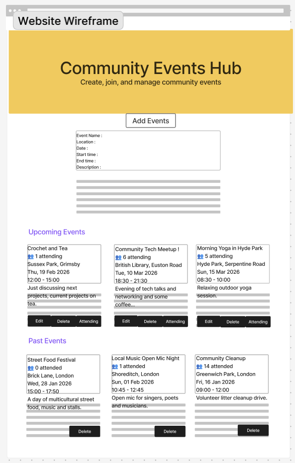  

### Layout description  
- A form at the top for adding and editing events  
- Two sections below:  
  - Upcoming Events  
  - Past Events  
- Each event appears as a card with:  
  - Title  
  - Location  
  - Date and time  
  - Description  
  - Attendance badge  
  - Buttons (Edit, Attend, Delete)  

---

## 8. Trello (Project Management)  

Suggested format:  
  

We organised tasks into:  
- To Do  
- In Progress  
- Done  

---

## 9. Project Structure

FULLSTACK-COMMUNITY-EVENTS-HUB/
│
├── client/
│   ├── img/
│   ├── node_modules/
│   ├── public/
│   ├── src/
│   │   ├── main.js
│   │   └── style.css
│   ├── .gitignore
│   ├── index.html
│   ├── package-lock.json
│   └── package.json
│
├── screenshots/
│   ├── add-events-mobileversion-2.png
│   ├── add-events-mobileversion.png
│   ├── Add-events-webversion.png
│   ├── dummy-seed-data.png
│   ├── past-events-mobileversion.png
│   ├── past-events-web-version.png
│   ├── schema-visualizer.png
│   ├── sql-query.png
│   ├── table.png
│   ├── upcoming-events-mobileversion.png
│   └── upcoming-events-webversion.png
│
├── server/
│   ├── node_modules/
│   ├── .env
│   ├── package-lock.json
│   ├── package.json
│   └── server.js
│
├── .gitignore
├── README.md
└── SQL.sql

---

## 10. Frontend Functionality  

### Fetching and Displaying Events  
- Events are fetched using `fetch()` with async/await from the Render server.  
- Data is rendered dynamically using DOM manipulation.  
- Events are automatically split into **Upcoming** and **Past** based on today’s date.  
- Each event card displays:  
  - Event name  
  - Location  
  - Date  
  - Time  
  - Description  
  - Number of attendees  

### Event Submission (Create)  
- Users can add new events using a form.  
- Form data is sent to the server via a `POST /events` request.  
- After submission:  
  - The form resets  
  - The event list refreshes automatically  

### Editing Events  
- Users can edit **upcoming events only**.  
- Clicking **Edit** pre-fills the form with the existing event details.  
- The submit button changes to **“Update Event”** in edit mode.  
- On save, a `PUT /events/:id` request updates the database.  
- The UI refreshes immediately after a successful update.  

### Attending Events  
- Users can mark attendance for **upcoming events only**.  
- Clicking **“I’m Attending”** sends a `POST /events/:id/attend` request.  
- The attendee badge updates automatically to show the new count.  

### Past vs Upcoming Events  
- Upcoming events show: **Edit + Attend + Delete buttons**.  
- Past events show:  
  - ❌ No Edit button  
  - ❌ No Attend button  
  - ✅ Only a **Delete** button  
  - Attendee badge displays **“X attended”** instead of “X attending”.  

### Deleting Events  
- A confirmation dialog appears before deletion.  
- Clicking **Delete** sends a `DELETE /events/:id` request.  
- The event is removed from the screen immediately after success.  

---  

## 11. Backend Functionality  

### Express Server Setup  
- Built with **Node.js + Express.js**.  
- Uses `cors()` to allow communication between frontend and backend.  
- Uses `express.json()` to parse incoming JSON requests.  
- Environment variables are managed using **dotenv**.  

### Database Connection (Supabase + Postgres)  
- Connects to Supabase Postgres using the `pg` library (`pg.Pool`).  
- Secure SSL connection is enabled (`rejectUnauthorized: false`).  
- All data is stored in an `events` table in Supabase.  

### API Routes  

#### Health Check  
- `GET /`  
- Confirms the server is running by returning:  Hi, there!

---  

## 12. API Endpoints  

### GET `/events`  
Fetches all events from the database ordered by event date (earliest first).  

### POST `/events`  
Creates a new event.  
- Requires `event_name`, `location`, `event_date`, `start_time`, `end_time`, `description`  
- Stores the event in Supabase Postgres  
- Automatically starts with empty attendance  

### PUT `/events/:id`  
Updates an existing event by ID.  
- Allows editing name, location, date, time, and description  

### DELETE `/events/:id`  
Deletes an event by ID after user confirmation.  

### POST `/events/:id/attend`  
Marks the current user as attending the event.  
- Updates the `attending_users` field in the database  
- Prevents duplicate attendance entries  

---

## 13. Database Schema  

We used a Supabase Postgres table called **events**.  

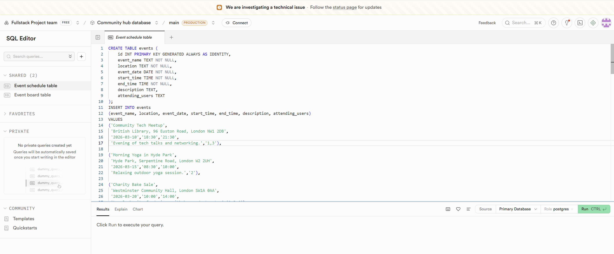

### SQL Schema  

CREATE TABLE events (
    id INT PRIMARY KEY GENERATED ALWAYS AS IDENTITY,
    event_name TEXT NOT NULL,
    location TEXT NOT NULL,
    event_date DATE NOT NULL,
    start_time TIME NOT NULL,
    end_time TIME NOT NULL,
    description TEXT,
    attending_users TEXT
);

### Schema Visualizer  

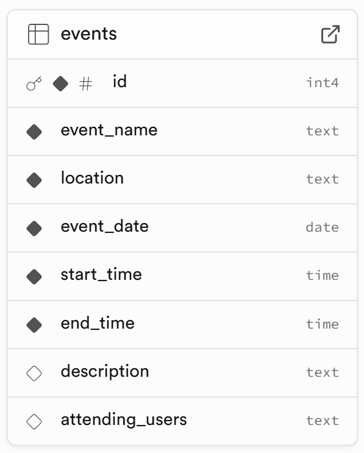 

---

## 14. Dummy Seed Data  

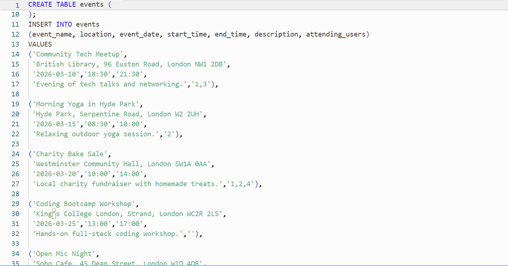 

### Table `Events`

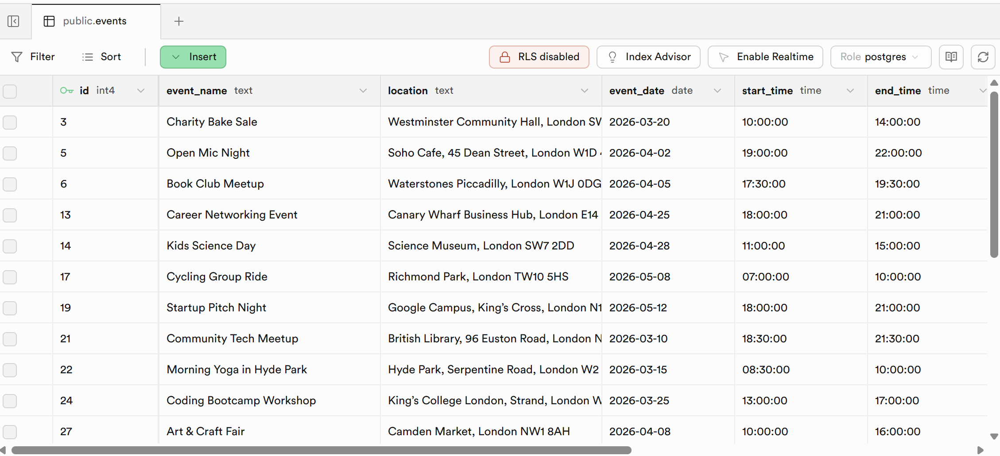 

---

## 15. Stretch Goals Achieved  

- Attendance count badge for each event  
- Automatic separation of past and upcoming events  
- Form edit mode with “Update Event” button  
- Delete confirmation pop-up  
- Improved date formatting  
- Improved time formatting (no seconds displayed)  

---

## 16. Future Features (Planned)  

- Real user authentication  
- Display real usernames instead of a static ID  
- Comment section on events  
- Event image uploads  
- Interactive map view for event locations  
- Search bar to find events by name or location  
- Filter events by date, location, or category  

---

## 17. Collaboration  

- Worked in separate Git branches  
- Used pull requests to merge to main  
- Daily stand-ups in morning and evening  
- Communicated via Discord  
- Pair programmed for difficult tasks  
- Reviewed each other’s code before merging  

---

## 18. How to Run the Project Locally  

1. Clone the repository  

2. Navigate to the server folder  

  cd server
  npm install pg, express, dotenv, cors

3. Create server.js and .env file with your Supabase connection string

4. Start the server

5. Navigate to the client folder

  cd client
  npm install

6. Navigate to the main folder
create .gitignore

7. To run use `npm run dev` for both client and server

---

## 19. Deployment  

- GitHub Repository link **To View Files**

🔗 **GitHub Repository:** https://github.com/bh-official/fullstack-community-events-hub

- Server deployed on **Render Web Service**  

🔗 **Live Server URL:** https://fullstack-community-events-hub-server.onrender.com  

- Client deployed as **Render Static Site**  

🔗 **Live Client URL:** https://fullstack-community-events-hub-client.onrender.com  

---

## 20. Screenshots   

### Website View Screenshots 

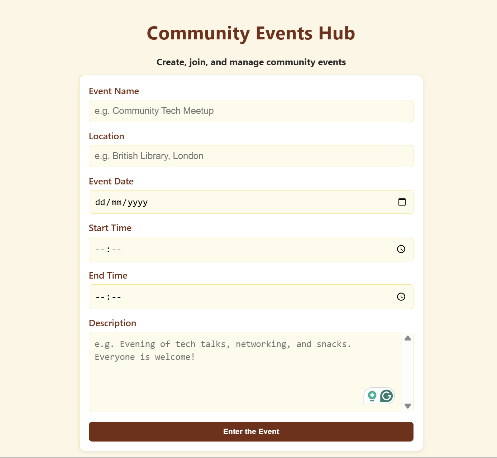  

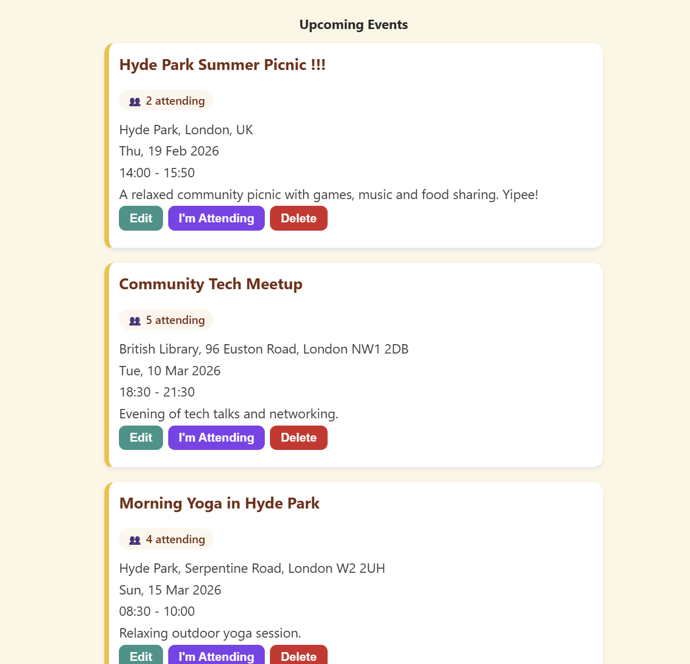  

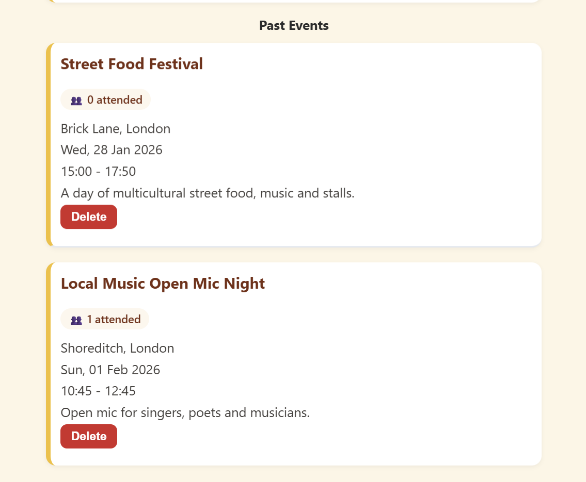 

### Mobile View Screenshots 

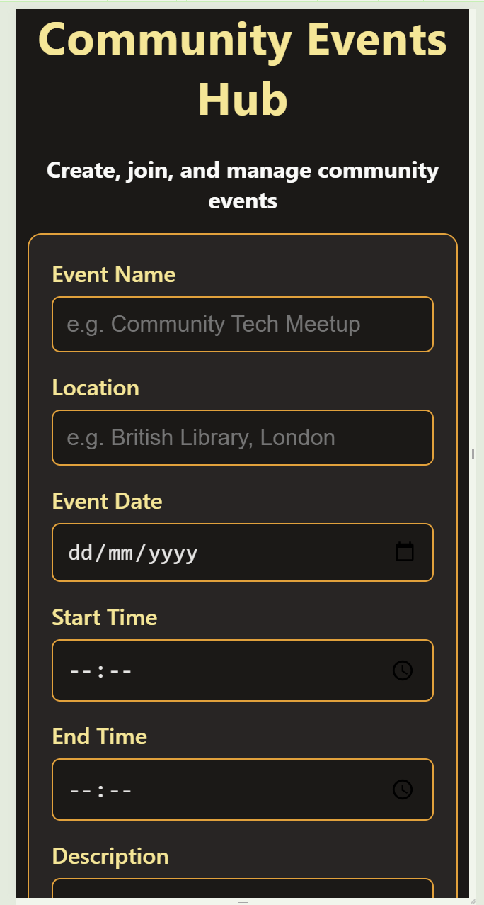  

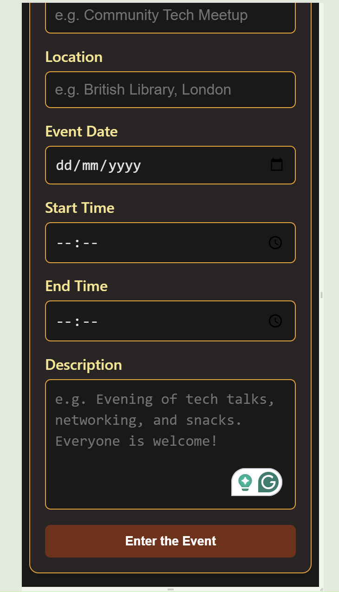 

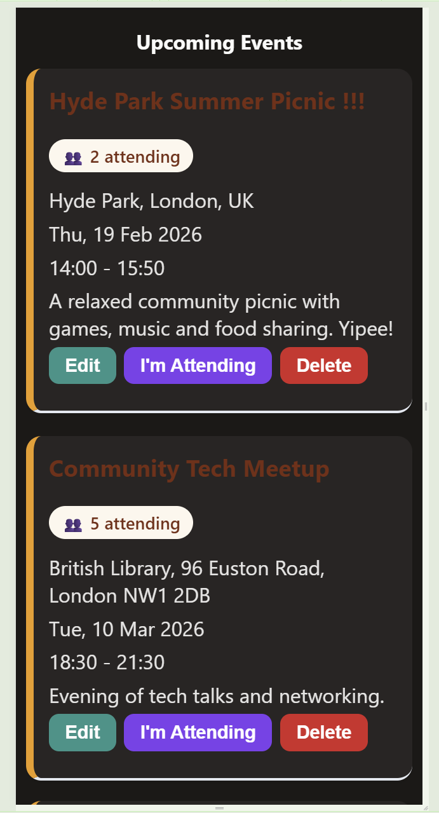 

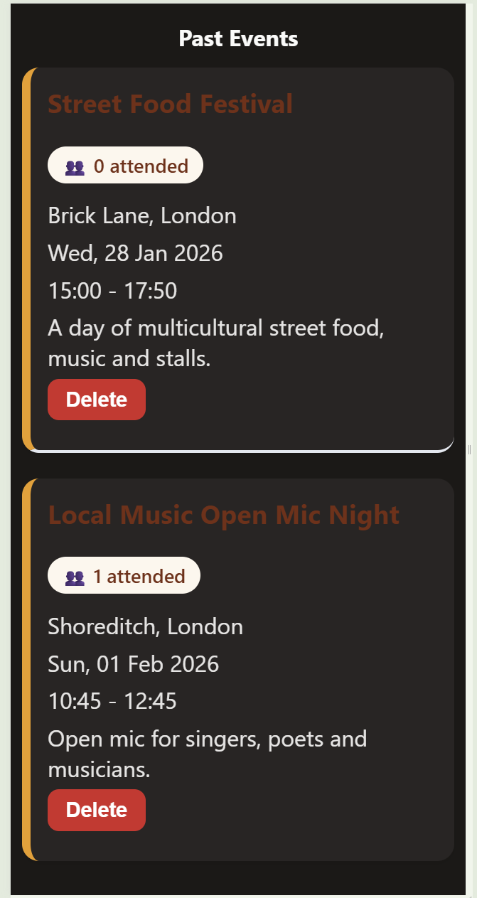 

